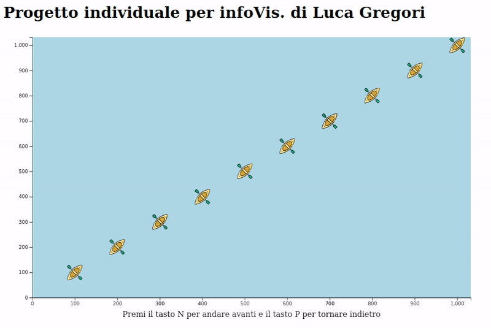

##' Progetto individuale per il corso di Visualizzazione delle Informazioni (2020/2021) Roma Tre
Autore: *Luca Gregori*



### Traccia
Crea un file json con dei dati multivariati: ci sono 10 data-cases e ogni data-case ha sei variabili quantitative i cui valori sono tutti positivi. Con questi dati disegna 10 barchette viste dall'alto (è sufficiente la silhouette) distribuite nell'area di disegno. Una barchetta rappresenta un data-case ed utilizza la variabile 1 e la variabile 2 di quel dataset per le coordinate x ed y, rispettivamente. Premendo il tasto "n" tutte le barchette cambiano posizione e si portano in corrispondenza delle variabili 3 e 4 del rispettivo data-case. Premendo ancora "n" si passa ad utilizzare le variabili 4 e 6. Premendo ancora si torna alla configurazione iniziale. Premendo invece il tasto "p" le barchette si portano nella configurazione precedente. Fai in maniera che le transizioni avvengano progressivamente e non a salti, tramite un'animazione fluida. Usa le scale D3.js per mappare l'intervallo dei valori delle variabili (che è arbitrario) sull'intervallo dei valori delle coordinate, che dipende dalla tua interfaccia.

### Getting Started
Per far eseguire un server utilizzando python (versione 3) utilizzare il seguente comando:
```
python -m http.server 9000
```
È possibile visualizzare la demo al seguente url: http://localhost:9000/

### Copyright:

Kayak icon made by [Freepik](https://www.freepik.com) from [Flaticon](https://www.flaticon.com/)
